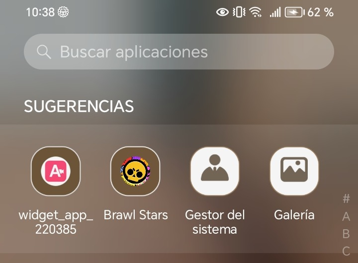
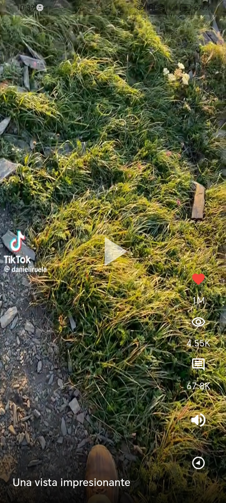
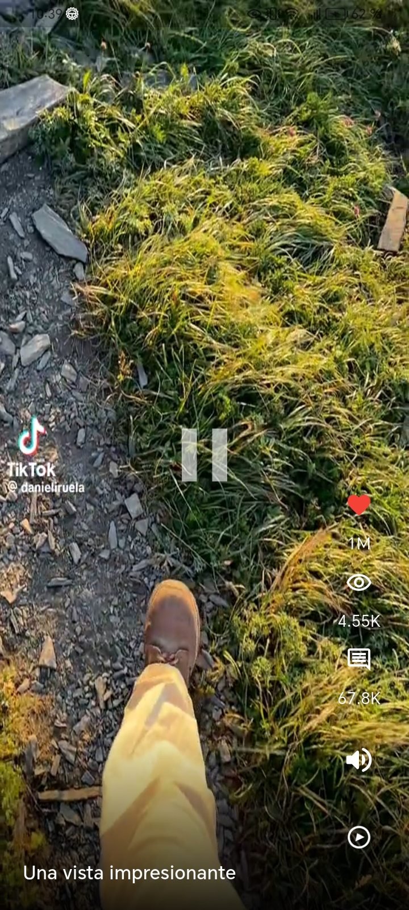
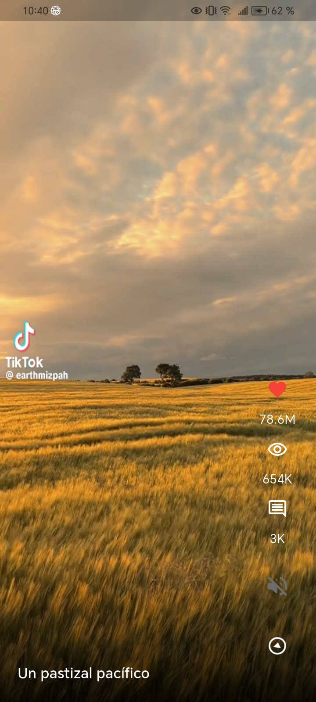
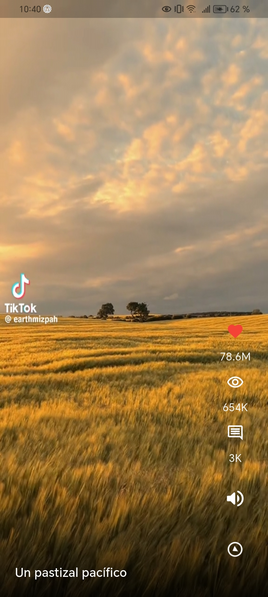
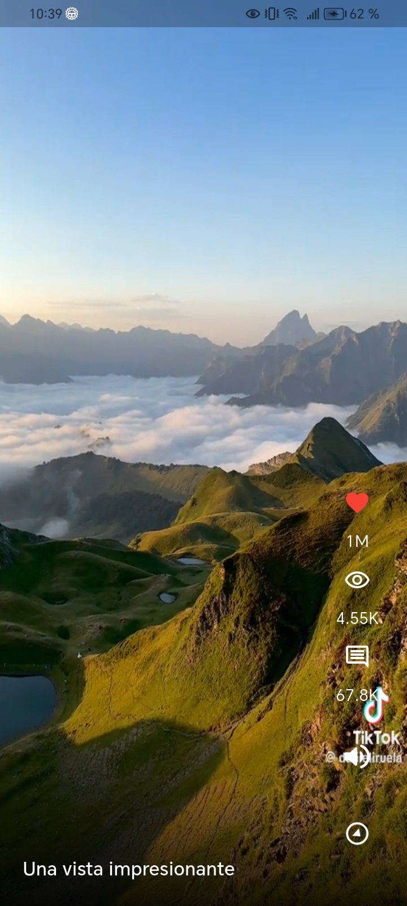

## 🏫 UNIVERSIDAD TECNOLÓGICA DE XICOTEPEC DE JUÁREZ  
### 👩‍💻 INGENIERÍA EN DESARROLLO Y GESTIÓN DE SOFTWARE  
#### 📚 DÉCIMO CUATRIMESTRE

---

### 📖 MATERIA:  
## **Desarrollo Móvil Integral**

---
### 📖 PRÁCTICA 4:  
## **App de Reproducción de Videos (Stateless y Statefull Widgets)**
---

### ALUMNA:  
## **Alina Bonilla Paredes**

---

### DOCENTE:  
## **M.T.I. Marco Antonio Ramírez Hernández**

---

En esta práctica se realizó la construcción de una aplicacación móvil que permite la reproducción de videos en forma vertica con paginación y algunos elemento de interacción simulando un ejemplo de 'TikTok'.

---

  <h3>Capturas de ejecución de la aplicación</h3>

  <table border="1" cellspacing="0" cellpadding="8">
    <tr>
      <th>Descripción</th>
      <th>Imagen</th>
    </tr>
    <tr>
      <td>Ícono personalizado de la app</td>
      <td></td>
    </tr>
    <tr>
      <td>Splash screen.</td>
      <td></td>
    </tr>
    <tr>
      <td>Botón de reproducción en funcionamiento.</td>
      <td></td>
    </tr>
    <tr>
      <td>Botón de pausa en funcionamiento.</td>
      <td></td>
    </tr>
    <tr>
      <td>Cambio de ícono al silenciar sonido</td>
      <td></td>
    </tr>
    <tr>
      <td>Cambio de ícono al activar sonido</td>
      <td></td>
    </tr>
    <tr>
      <td>Funcionamiento del scroll en los videos</td>
      <td></td>
    </tr>
    <tr>
      <td>Vista general con íconos implementados</td>
      <td></td>
    </tr>
   
  </table>

---
